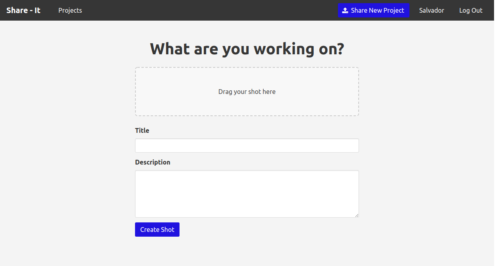
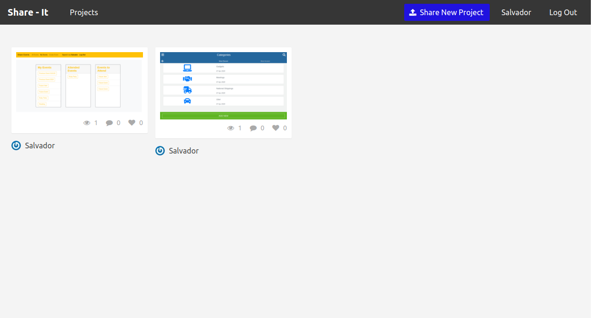
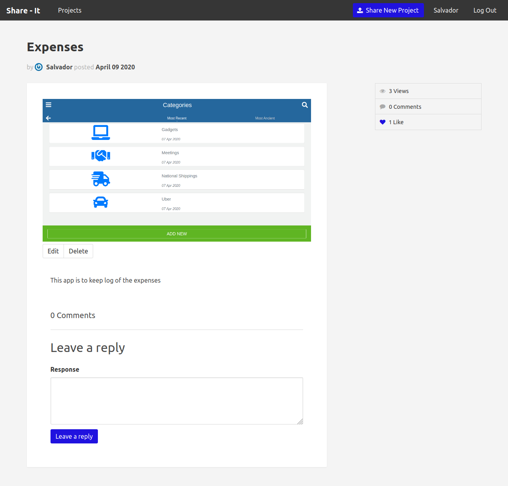

# Share it 

This is a Ruby on Rails app. Where users can share their designs, like other designs, and comment on the different posts.

# What it does

- Everyone can see all the post
- When the user Sign-in or Sign-up can add a new post, including a picture and also they can comment or like the posts.

# Future Features

- Load a profile picture in the user account.

- Mobile Design.

- Private messages to communicate with other users.

# How to run this project

- Install ruby.
- Install ruby on rails.
- Install bundle.
- Run "bundle install" inside folder.
- Run "rails server" inside folder.
- Go to http://127.0.0.1:3000/

## Author

**Salvador Olvera**
- Linkedin: [Salvador Olvera](https://www.linkedin.com/in/salvador-olvera-n)
- Github: [@Salvador-ON](https://github.com/Salvador-ON)
- Twitter: [@Salvador Olvera_ON](https://twitter.com/Salvador_ON) 

## Contributing

This is a project for educational purposes only. We are not accepting contributions.

## Show your support

Give a ⭐️ if you like this project!

## Enjoy!
